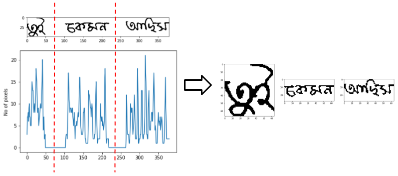

## Offline Bengali Handwritten Sentence Recognition using BiLSTM and CTC Networks

**Author:** M. A. Muhaimin Sakib, Omar Sharif and Mohammed Moshiul Hoque

**Conference:** This work is accepted in 5th International Conference on Internet of Things and Connected Technologies (Springer). [ICIoTCT 2020](http://iciotct.iaasse.org/home)

**ResearchGate:** [Paper Link](https://www.researchgate.net/publication/342707348_Offline_Bengali_Handwritten_Sentence_Recognition_using_BiLSTM_and_CTC_Networks)

**Google Scholar:** [Paper Link](https://scholar.google.com/scholar?hl=en&as_sdt=0%2C5&authuser=1&q=Offline_Bengali_Handwritten_Sentence_Recognition_using_BiLSTM_and_CTC_Networks&btnG=)

**Code and Dataset of this work are realeased here**

## Abstract

It is a very challenging task to recognize unconstrained Bengali
handwritten text due to its cursive nature. This paper introduces an
offline technique of recognizing handwritten Bengali sentences based on
BiLSTM architecture and connectionist temporal classification (CTC)
output layer. The traditional approach of detecting handwritten sentence
recognition rises the computational complexity due to the difficulty
of combining isolated characters. The proposed method only segments
the sentences into words, recognizes separately and combines them to
represents the output sentence. The proposed technique is evaluated
with 450 Bengali sentences and achieved 92% accuracy for recognizing
sentences considering 15 distinct writing styles.

## Data Statistics

|                                                                                                                                                                             | Training | Testing | Accuracy |
|:---------------------------------------------------------------------------------------------------------------------------------------------------------------------------:|:--------:|:-------:|:--------:|
| [Number of sentences](https://github.com/s4k1b/Bangla-Language-Processing-BLP/tree/master/Offline%20Bengali%20Handwritten%20Sentence%20Recongnition/Dataset/sentence_image) | 300      | 250     |          |
| [Number of words](https://github.com/s4k1b/Bangla-Language-Processing-BLP/tree/master/Offline%20Bengali%20Handwritten%20Sentence%20Recongnition/Dataset/word_image)         | 930      | 465     |          |
| Avg. no. of words per sentence                                                                                                                                              | 3.7      | 3.5     | 92%      |
| Writing Styles                                                                                                                                                              | 15       | 15      |          |
| Age range                                                                                                                                                                   | 19-24    | 19-24   |          |

## Framework and Methodology

The following figure represents our proposed framework for handwritten sentence recognition.

### Preprocessing

### Word separation

### Feature extraction process

### Input and output of BiLSTM network

### CTC decoding and loss value calcuation

## Result and Analysis

We evaluated the system by considering different sentence lengths and different writing styles to see how accuracy varies depending on various contexts.

### Accuracy versus sentence length

### Performance of the system for various writing styles

